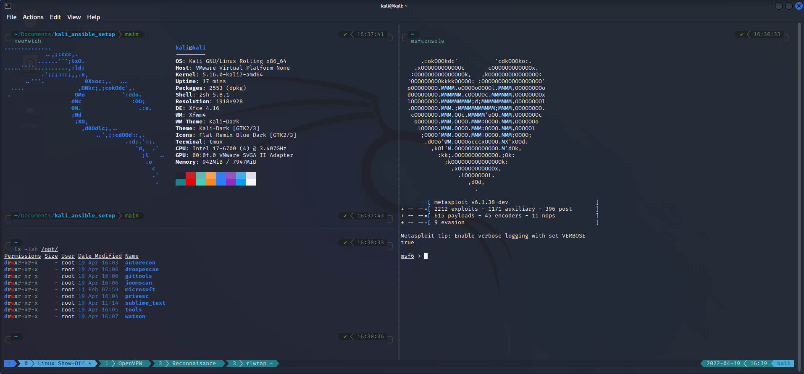

# Kali Linux Ansible Setup

This is my personal Kali Linux setup that I install as a base for my fresh Kali Linux images. There are no initial setup requirements, as the install script should take care of everything.  One caveat: this may not work if you ar using gnome instead of the default XFCE, as it does some customization to the latter.

This repository is constantly being updated with new packages and configurations. It can be used as a template to set up your own prefered Kali Linux installation. 

### Look and feel

The Ansible script uses the powerlevel10k zsh theme in combination with the nord-tmux theme by arcticicestudio. The ls command is replaced by exa to get more color and detail in file listings. 
A screenshot of the themed setup is shown below.

### Installation

To install, simply run the `deploy.sh` script on a clean install of Kali Linux (tested on 2023.3).  You will be prompted to enter your sudo password, which will then install Ansible and its prerequisites, then runs the ansible-playbook command. You will need to enter your sudo password one more time at this prompt to kick off the customization.  The script can take quite awhile to run, depending on how many packages need to be updated and your download speed.

1. Run deploy.sh
2. Enter your sudo password at the prompt
3. Enter your "become" (sudo) password at the prompt
4. Wait
5. ?
6. Profit!

### Post configuration

After the playbook has finished, you will need to reboot the system as many packages that are in use need to be updated.  Next, launch your terminal and you will be prompted to configure the zsh prompt to your preference. If you want to skip customization press 'q'.  If you want to redo the configuration you can always reinitialize the configuration menu by running the command `p10k configure`.  

You will have to configure root separately from your regular user. 

After configuring the terminal prompt, you can also launch a tmux session and install the themes and plugins that were applied during the configuration through the `ctrl + b + I` (capital i) hotkey. 

### Possible issues

The playbook clones different Github repositories and downloads several release files from dynamic GitHub pages. It's possible that one of the files is no longer available or that the location has changed. If it errors out, just change the URL's to the new correct file location. I added some additional error handling so it should break the script completely. 

## Customization list

Need to update this with all of the steps that Ansible will take in this build

## TODO: 

### create custom folders

- [x] ~/bin
- [x] ~/scripts
- [x] ~/tools
- [x] ~/uploads
- [ ] ~/wordlists
- [ ] ~/htb
- [ ] ~/ctf

### Shell Customizations

- [x] Powerline fonts
- [x] oh-my-zsh
- [x] copy .zshrc file to ~/
- [x] powerlevel10k

### UX Customization
- [ ] Check to ensure user is using xfce and not gnome (may or may not break since it customizes xfce)
- [ ] Change desktop background

### security

- [ ] Generate SSH keys
- [ ] Create SSH user
- [ ] Customize sshd
- [ ] Firewall rules?

### Install Tools

- [ ] Pwndrop
- [ ] _any suggestions?_

### create symlinks

- [ ] ln -s `<seclists install location>` ~/wordlists/Seclists
- [ ] ln -s /usr/share/wordlists ~/wordlists
- [ ] ln -s `<impacket examples folder>` ~/tools/impacket
- [ ] ln -s /usr/share/windows-binaries ~/uploads/windows
- [ ] ln -s /usr/share/windows-resources ~/uploads/windows

## References

Thanks to the below projects and resources for making this all work!
- https://github.com/IppSec/parrot-build
- https://github.com/Aegrah/kali_ansible_setup
- https://stackoverflow.com/questions/5927489/looking-for-files-not-owned-by-a-specific-user
- https://stackoverflow.com/questions/39580797/how-to-escape-backslash-and-double-quote-in-ansible-script-module
- 
